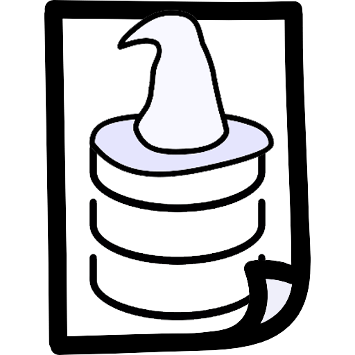

DataMagus Revival
=================

DataMagus is an application for database design — 
ER diagrams for conceptual (logical) model and physical schemas.

This application is partial multiplatfotm (MacOS and Windows) and 
being developed on C# and Avalonia UI.

It's a my pet-project.

Motivation
----------

Currently, there are almost no programs left that would help you 
work with the domain model and design a database.
                                                    

