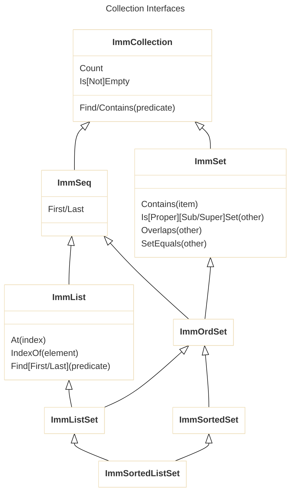
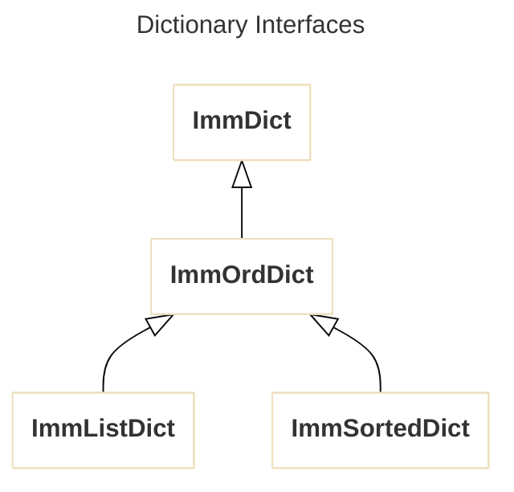

Immutable Collections
---------------------

```mermaid
--- 
  title: Collection Interfaces
  config:                           
    theme: base
    class:
      hideEmptyMembersBox: true
---        
classDiagram
    class ImmCollection
    style ImmCollection fill:#FFFFFF
    ImmCollection: Count
    ImmCollection: Is[Not]Empty
    ImmCollection: Find/Contains(predicate)

    class ImmSeq
    style ImmSeq fill:#FFFFFF
    ImmCollection <|-- ImmSeq
    ImmSeq: First/Last

    class ImmList
    style ImmList fill:#FFFFFF
    ImmSeq <|-- ImmList
    ImmList: At(index)
    ImmList: IndexOf(element)
    ImmList: Find[First/Last](predicate)

    class ImmSet
    style ImmSet fill:#FFFFFF
    ImmCollection <|-- ImmSet
    ImmSet: Contains(item)
    ImmSet: Is[Proper][Sub/Super]Set(other)
    ImmSet: Overlaps(other)
    ImmSet: SetEquals(other)

    class ImmOrdSet
    style ImmOrdSet fill:#FFFFFF
    ImmSeq <|-- ImmOrdSet
    ImmSet <|-- ImmOrdSet

    class ImmListSet
    style ImmListSet fill:#FFFFFF
    ImmList <|-- ImmListSet    
    ImmOrdSet <|-- ImmListSet    

    class ImmSortedSet
    style ImmSortedSet fill:#FFFFFF
    ImmOrdSet <|-- ImmSortedSet

    class ImmSortedListSet
    style ImmSortedListSet fill:#FFFFFF
    ImmListSet <|-- ImmSortedListSet    
    ImmSortedSet <|-- ImmSortedListSet    

```

```mermaid
--- 
  title: Dictionary Interfaces
  config:                           
    theme: base
    class:
      hideEmptyMembersBox: true
---    
classDiagram
    class ImmDict
    style ImmDict fill:#FFFFFF

    class ImmOrdDict
    style ImmOrdDict fill:#FFFFFF
    ImmDict <|-- ImmOrdDict

    class ImmListDict
    style ImmListDict fill:#FFFFFF
    ImmOrdDict <|-- ImmListDict

    class ImmSortedDict
    style ImmSortedDict fill:#FFFFFF
    ImmOrdDict <|-- ImmSortedDict


```